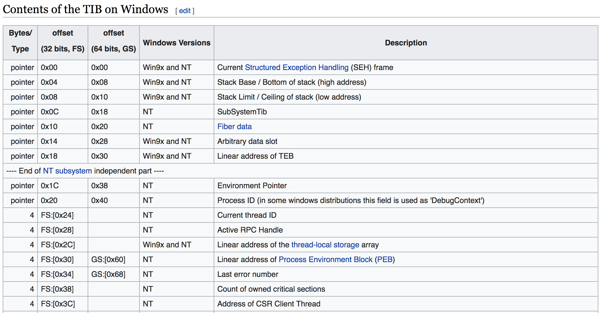

## !exchain

The !exchain extension displays the current exception handler chain.

### Syntax

!exchain [Options]

### Parameters

Options 
One of the following values:

**/c** 
Displays information that is relevant for debugging a C++ try/catch exception, if such an exception is detected. 

**/C**
Displays information that is relevant for debugging a C++ try/catch exception, even when such an exception has not been detected. 

**/f**
Displays information that is obtained by walking the CRT function tables, even if a CRT exception handler was not detected. 


### DLL 

The !exchain extension is available only for an x86-based target computer.


```
0:002> !exchain
0218ffe4: ntdll!strchr+113 (7c92e900)
Invalid exception stack at ffffffff
```


## How to read ExceptionList ?

```
TEB ----> TIB ----> _EXCEPTION_REGISTRATION_RECORD
```




- **TEB (Thread Environment Block)**

```
  484 typedef struct _TEB
  485 {
  486     NT_TIB          Tib;                        /* 000 */
  487     PVOID           EnvironmentPointer;         /* 01c */
  488     CLIENT_ID       ClientId;                   /* 020 */
  489     PVOID           ActiveRpcHandle;            /* 028 */
  490     PVOID           ThreadLocalStoragePointer;  /* 02c */
  491     PVOID           Peb;                        /* 030 */
  492     ULONG           LastErrorValue;             /* 034 */
  493     ULONG           CountOfOwnedCriticalSections;/* 038 */
  494     PVOID           CsrClientThread;            /* 03c */
  495     PVOID           Win32ThreadInfo;            /* 040 */
  496     ULONG           Win32ClientInfo[31];        /* 044 used for user32 private data in Wine */
  497     PVOID           WOW32Reserved;              /* 0c0 */
  498     ULONG           CurrentLocale;              /* 0c4 */
  499     ULONG           FpSoftwareStatusRegister;   /* 0c8 */
  500     PVOID           SystemReserved1[54];        /* 0cc used for kernel32 private data in Wine */
  501     PVOID           Spare1;                     /* 1a4 */
  502     LONG            ExceptionCode;              /* 1a8 */
  503     PVOID     ActivationContextStackPointer;            /* 1a8/02c8 */
  504     BYTE            SpareBytes1[36];            /* 1ac */
  505     PVOID           SystemReserved2[10];        /* 1d4 used for ntdll private data in Wine */
  506     GDI_TEB_BATCH   GdiTebBatch;                /* 1fc */
  507     ULONG           gdiRgn;                     /* 6dc */
  508     ULONG           gdiPen;                     /* 6e0 */
  509     ULONG           gdiBrush;                   /* 6e4 */
  510     CLIENT_ID       RealClientId;               /* 6e8 */
  511     HANDLE          GdiCachedProcessHandle;     /* 6f0 */
  512     ULONG           GdiClientPID;               /* 6f4 */
  513     ULONG           GdiClientTID;               /* 6f8 */
  514     PVOID           GdiThreadLocaleInfo;        /* 6fc */
  515     PVOID           UserReserved[5];            /* 700 */
  516     PVOID           glDispatchTable[280];        /* 714 */
  517     ULONG           glReserved1[26];            /* b74 */
  518     PVOID           glReserved2;                /* bdc */
  519     PVOID           glSectionInfo;              /* be0 */
  520     PVOID           glSection;                  /* be4 */
  521     PVOID           glTable;                    /* be8 */
  522     PVOID           glCurrentRC;                /* bec */
  523     PVOID           glContext;                  /* bf0 */
  524     ULONG           LastStatusValue;            /* bf4 */
  525     UNICODE_STRING  StaticUnicodeString;        /* bf8 used by advapi32 */
  526     WCHAR           StaticUnicodeBuffer[261];   /* c00 used by advapi32 */
  527     PVOID           DeallocationStack;          /* e0c */
  528     PVOID           TlsSlots[64];               /* e10 */
  529     LIST_ENTRY      TlsLinks;                   /* f10 */
  530     PVOID           Vdm;                        /* f18 */
  531     PVOID           ReservedForNtRpc;           /* f1c */
  532     PVOID           DbgSsReserved[2];           /* f20 */
  533     ULONG           HardErrorDisabled;          /* f28 */
  534     PVOID           Instrumentation[16];        /* f2c */
  535     PVOID           WinSockData;                /* f6c */
  536     ULONG           GdiBatchCount;              /* f70 */
  537     ULONG           Spare2;                     /* f74 */
  538     ULONG           Spare3;                     /* f78 */
  539     ULONG           Spare4;                     /* f7c */
  540     PVOID           ReservedForOle;             /* f80 */
  541     ULONG           WaitingOnLoaderLock;        /* f84 */
  542     PVOID           Reserved5[3];               /* f88 */
  543     PVOID          *TlsExpansionSlots;          /* f94 */
  544 } TEB, *PTEB;
  545 
```

- **TIB (Thread Information Block)**

```
  370 typedef struct _NT_TIB {
  371   struct _EXCEPTION_REGISTRATION_RECORD *ExceptionList;
  372   PVOID StackBase;
  373   PVOID StackLimit;
  374   PVOID SubSystemTib;
  375   union {
  376     PVOID FiberData;
  377     DWORD Version;
  378   } DUMMYUNIONNAME;
  379   PVOID ArbitraryUserPointer;
  380   struct _NT_TIB *Self;
  381 } NT_TIB,*PNT_TIB;
```

- **\_EXCEPTION_REGISTRATION_RECORD**

```
  369 typedef EXCEPTION_ROUTINE *PEXCEPTION_ROUTINE;

  384 typedef struct _EXCEPTION_REGISTRATION_RECORD
  385 {
  386     struct _EXCEPTION_REGISTRATION_RECORD *Next;
  387     PEXCEPTION_ROUTINE Handler;
  388 } EXCEPTION_REGISTRATION_RECORD, *PEXCEPTION_REGISTRATION_RECORD;
```

- **PEXCEPTION_ROUTINE**

```
  361 typedef
  362 EXCEPTION_DISPOSITION
  363 NTAPI
  364 EXCEPTION_ROUTINE(
  365   struct _EXCEPTION_RECORD *ExceptionRecord,
  366   PVOID EstablisherFrame,
  367   struct _CONTEXT *ContextRecord,
  368   PVOID DispatcherContext);
```

- **\_EXCEPTION_RECORD**

```
  195 typedef struct _EXCEPTION_RECORD {
  196   DWORD ExceptionCode;
  197   DWORD ExceptionFlags;
  198   struct _EXCEPTION_RECORD *ExceptionRecord;
  199   PVOID ExceptionAddress;
  200   DWORD NumberParameters;
  201   ULONG_PTR ExceptionInformation[EXCEPTION_MAXIMUM_PARAMETERS];
  202 } EXCEPTION_RECORD, *PEXCEPTION_RECORD;
```

```
0:001> !teb
TEB at 7ffde000
    ExceptionList:        0077feec
    StackBase:            00780000
    StackLimit:           0077c000
    SubSystemTib:         00000000
    FiberData:            00001e00
    ArbitraryUserPointer: 00000000
    Self:                 7ffde000
    EnvironmentPointer:   00000000
    ClientId:             00000be0 . 00000f18
    RpcHandle:            00000000
    Tls Storage:          00000000
    PEB Address:          7ffd7000
    LastErrorValue:       0
    LastStatusValue:      0
    Count Owned Locks:    0
    HardErrorMode:        0
```

```
0:001> dd fs:[0]
003b:00000000  0077feec 00780000 0077c000 00000000
003b:00000010  00001e00 00000000 7ffde000 00000000
003b:00000020  00000be0 00000f18 00000000 00000000
003b:00000030  7ffd7000 00000000 00000000 00000000
003b:00000040  00000000 00000000 00000000 00000000
003b:00000050  00000000 00000000 00000000 00000000
003b:00000060  00000000 00000000 00000000 00000000
003b:00000070  00000000 00000000 00000000 00000000
```

## References

- https://www.securitysift.com/windows-exploit-development-part-6-seh-exploits/
- https://doxygen.reactos.org/d5/db1/dll_2win32_2dbghelp_2compat_8h_source.html
- https://msdn.microsoft.com/en-us/library/ms680657(v=vs.85).aspx
- https://www.nirsoft.net/kernel_struct/vista/TEB.html
- https://en.wikipedia.org/wiki/Win32_Thread_Information_Block
